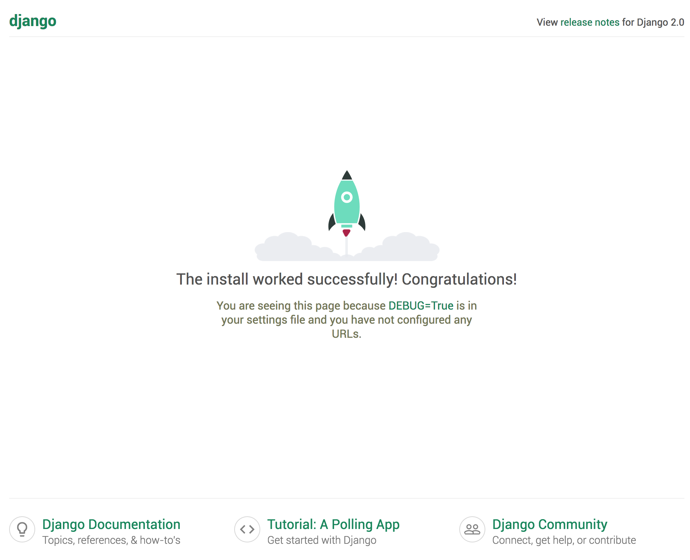

# Django Project

接下來讓我們開始第一個 Django Project 吧！

建立 Django Project 很簡單，只要輸入

```
pipenv run django-admin startproject blog
```

就可以看到我們的資料夾多了一個叫做 blog 的目錄，這個目錄當中的檔案如下：

```
.
├── Pipfile
├── Pipfile.lock
└── blog
    ├── blog
    │   ├── __init__.py
    │   ├── settings.py
    │   ├── urls.py
    │   └── wsgi.py
    └── manage.py
```

在這個階段我們只要注意 manage.py 這個檔案就好。manage.py 是一個 Django 的命令列工具，在 Django 當中許多的工作都必須要透過 manage.py 來完成。接下來我們將執行第一個用 manage.py 的工作，也是開發 Django 中可能是最常跑的指令 - runserver。runserver 的目的是讓 Django 啟動一個簡單用的 web server，讓我們可以很容易的做開發。

首先先切到 blog 資料夾

```
cd blog
```

接著輸入

```
pipenv run python manage.py runserver
```

打開你的瀏覽器，在網址的部分輸入 http://localhost:8000/ ，應該會看到一個如下圖的頁面，這就代表你已經成功地創建了你的第一個 Django Project。


